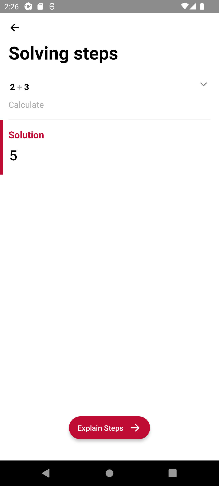
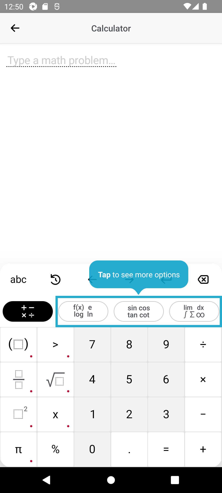

# Appium Assignment - MSSV: BIT220301

## 📱 Ứng dụng được chọn

- **Tên ứng dụng**: Photomath
- **Danh mục con**: Ứng dụng học toán hoặc khoa học
- **Lý do chọn**: Dựa trên 2 chữ số cuối của MSSV là `01`, `01 % 5 = 1` → thuộc danh mục **Học toán hoặc khoa học**. Photomath là ứng dụng học toán phổ biến, hỗ trợ giải bài toán bằng camera và có giao diện thân thiện phù hợp để kiểm thử tự động.

---

## Test Cases

### ✅ Test Case 1: Điều hướng đến màn hình lịch sử (History)
- **Mô tả:** Kiểm tra người dùng có thể mở được màn hình xem lịch sử các bài toán đã giải.
- **Kết quả mong đợi:** Màn hình lịch sử hiển thị thành công.

### ✅ Test Case 2: Nhập biểu thức toán học bằng tay (2 + 3)
- **Mô tả:** Kiểm tra tính năng nhập công thức toán học bằng bàn phím tay trên ứng dụng.
- **Kết quả mong đợi:** Biểu thức được nhập thành công và không phát sinh lỗi khi submit.

### ✅ Test Case 3: Kiểm tra kết quả giải toán
- **Mô tả:** Kiểm tra xem sau khi nhập biểu thức, ứng dụng hiển thị đúng kết quả lời giải.
- **Kết quả mong đợi:** Kết quả hiển thị là **5**, khớp với biểu thức đã nhập.
---

## 🛠️ Hướng dẫn chạy kịch bản kiểm thử

### 1. Cài đặt môi trường

- Cài Appium Server:
  ```bash
  npm install -g appium
  ```
- Cài đặt Android Studio và thiết lập emulator (API 30 hoặc cao hơn).
- Cài đặt Python 3.8+ và các thư viện cần thiết:
  ```bash
  pip install Appium-Python-Client pytest
  ```
- Tải Photomath APK từ Google Play Store hoặc một nguồn đáng tin cậy.
- Khởi động Appium Server:
    ```bash
       appium
    ```
- Chạy kiểm thử:
    ```bash
    pytest test_photomath.py

## 🛠️ Kết quả chạy kiểm thử
- Test Case 1: Passed 
- Test Case 2: Passed.
- Test Case 3: Failed do không lấy được kết quả hiển thị đúng sau khi submit biểu thức.

## Khó khăn và cách khắc phục
Khó khăn: Không tìm thấy phần tử bằng ID do ứng dụng thay đổi cấu trúc.
Cách khắc phục: Sử dụng Appium Inspector để tìm XPath thay thế.

## Link minh họa

### Kết quả chạy kiểm thử

<p align="center">
  
  
  
  
  
  
</p>
